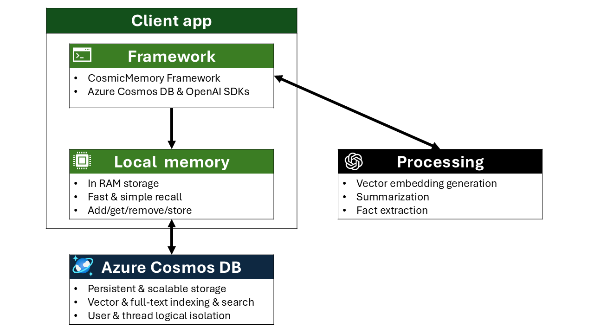

# CosmicMemory 🪐🧠

[](https://opensource.org/licenses/MIT)
[](https://www.python.org/downloads/)
[](https://azure.microsoft.com/en-us/products/cosmos-db/)
[](https://twitter.com/AzureCosmosDB)
[](https://www.linkedin.com/showcase/azure-cosmos-db/)
[](https://www.youtube.com/@AzureCosmosDB)

 
> **⚠️ Important:** This repository is provided as is. No guarantees exist regarding performance, maintenance, bug fixes, continued development, or supportability. However, you're welcome to this code as a starting point or inspiration for your own implementations.

CosmicMemory is a memory **sample** framework for AI agents that implements a two-tier memory architecture: **short-term memories** for persisting active or recent conversation threads and **long-term memories** for efficient context storage and retrieval.

**Short-Term Memories (Active Threads)**  
Store active conversation threads in client-side RAM (local) for immediate access during ongoing sessions. These memories provide full conversational context to your LLM with zero latency. Persist accumulated threadsin Azure Cosmos DB for durability and enable advanced retrieval capabilities including semantic search across conversations.

**Long-Term Memories (Summaries & Facts)**  
Generate AI-powered summaries and extract key facts from conversation threads and store them in Azure Cosmos DB. This condensed representation reduces LLM token consumption by providing essential context without passing entire conversation histories. Long-term memories filter out noise and irrelevant information, ensuring agents receive only the most pertinent context while keeping costs and latency low.




## Structure

CosmicMemory follows a modular architecture with clear separation of concerns:

```
CosmicMemory/
├── cosmic_memory.py          # High-level API and memory orchestration
├── utils/
│   ├── __init__.py          # Package exports
│   ├── cosmos_interface.py  # Azure Cosmos DB operations
│   └── processing.py        # Embedding generation and AI processing
├── mem_test.ipynb           # Usage examples and testing
├── test.py                  # Command-line test application
└── README.md
```

- **`cosmic_memory.py`** - High-level API providing intuitive methods for memory operations, client-side memory management, and orchestration of database and AI operations
- **`utils/cosmos_interface.py`** - Low-level Azure Cosmos DB functions for container creation, document CRUD operations, vector search, and query execution
- **`utils/processing.py`** - AI processing utilities including Azure OpenAI embedding generation, thread summarization, and token counting

## Table of Contents
- [Core Functionalities](#core-functionalities)
- [Setup](#setup)
  - [Prerequisites](#prerequisites)
  - [Installation](#installation)
  - [Configuration](#configuration)
- [Usage](#usage)
  - [Initialize CosmicMemory](#initialize-cosmicmemory)
  - [Create Memory Store](#create-memory-store)
  - [Add Memories](#add-memories)
  - [Client-Side Local Memory](#client-side-local-memory)
  - [Search and Retrieve Memories](#search-and-retrieve-memories)
  - [Summarize Conversations](#summarize-conversations)
  - [Delete Memories](#delete-memories)
- [Test Application](#test-application)
- [Data Models](#data-models)
- [Usage Guidance](#usage-guidance)
- [API Reference](#api-reference)
- [License](#license)


## Core Functionalities

### Client-Side Memory
- **Add to local** ⚡ - Store memories in client-side RAM for immediate access
- **Get from local** 📤 - Retrieve recent conversation context instantly for LLM prompts
- **Pop from local** ↩️ - Remove the most recent memory from RAM
- **Clear local** 🧹 - Reset client-side memory when starting new conversations

### Azure Cosmos DB Memory Persistence
- **Write to Database** 💾 - Persist individual memories directly to Azure Cosmos DB with automatic token counting and embeddings
- **Write Local to Daatabase** 📦 - Commit multiple accumulated memories from RAM to an Azure Cosmos DB container 
- **Database/Container Creation** 🏗️ - Automatically create Azure Cosmos DB database and container with full-text and vector indexing policies

### Advanced Search & Retrieval in Azure Cosmos DB
For memories written to Azure Cosmos DB, take advantage of advanced and semantic memories search capabilities:
- **Semantic Search** 🔍 - Find contextually relevant memories using vector similarity and Azure OpenAI embeddings
- **Recent Memories** 📅 - Retrieve the most recent interactions chronologically from persistent storage
- **Filter by User/Thread** 🎯 - Query memories by specific user IDs or conversation threads
- **Similarity Scoring** 📊 - Get relevance scores with semantic search results
- **Thread Summarization** 📝 - Generate LLM-based summaries of conversation threads with key facts extraction
- **Summary Retrieval** 📋 - Retrieve previously generated summaries from persistent storage (Azure Cosmos DB)
- **Memory Deletion** 🗑️ - Remove specific memories by ID from persistent storage

### Security & Infrastructure
- **Entra ID Authentication** 🔐 - Secure access using Azure's identity platform
- **Vector Embeddings** 🔢 - Automatic embedding generation using Azure OpenAI for semantic search capabilities


## Test Application

The `test.py` file provides a command-line interface for testing CosmicMemory functionality with an interactive AI chat session. It demonstrates real-world usage patterns including conversation history loading, memory persistence, and agent integration.

**Usage:**
```bash
# Run with specific thread and user IDs
python test.py -t "my-thread-123" -u "user-456"

# Auto-generate IDs if not provided
python test.py
```

The test application automatically loads previous conversation summaries, maintains conversation context, and saves new interactions to Azure Cosmos DB when the session ends.

## Data Models

CosmicMemory stores two types of documents in Azure Cosmos DB:

### Memory Document

One-turn-per-document model for conversation memories:

```json
{
  "id": "unique-guid",
  "type": "memory",
  "user_id": "user-123",
  "thread_id": "conversation-guid",
  "messages": [
    {
      "role": "user",
      "content": "How much fine ground espresso should I use for a double shot?",
      "token_count": 15
    },
    {
      "role": "agent",
      "content": "For a double shot (about 60ml output), here are the recommended doses:\n\n- **Light roast**: 18-19 grams\n- **Medium roast**: 17-18 grams\n- **Bold/dark roast**: 16-17 grams\n\nDarker roasts are less dense, so you need slightly less by weight. Start with these ranges and adjust based on your taste and extraction time (aim for 25-30 seconds).",
      "token_count": 89
    }
  ],
  "embedding": [],
  "timestamp": "2025-10-18T10:00:00Z"
}
```

### Summary Document

AI-generated summaries of conversation threads:

```json
{
  "id": "unique-guid",
  "type": "summary",
  "user_id": "user-123",
  "thread_id": "conversation-guid",
  "summary": "The user asked about making espresso at home. The agent provided detailed information about grind settings, dose amounts for different roasts, and extraction timing.",
  "facts": [
    "User is interested in home espresso preparation",
    "Double shot requires 16-19g depending on roast level",
    "Extraction should take 25-30 seconds",
    "Darker roasts need less coffee by weight due to lower density"
  ],
  "embedding": [],
  "token_count": 145,
  "last_updated": "2025-10-19T10:30:00Z"
}
```


## Setup

### Prerequisites

- Python 3.8+
- Azure Cosmos DB account
- Vector search enabled on your Azure Cosmos DB account [(learn more)](https://learn.microsoft.com/azure/cosmos-db/nosql/vector-search#enable-the-vector-indexing-and-search-feature)
- Azure OpenAI resource with an embedding and completions model deployed
- Azure authentication configured (Azure Entra ID or Managed Identity)
- [Control-Plane and Data-Plane RBAC](https://learn.microsoft.com/azure/cosmos-db/nosql/how-to-connect-role-based-access-control?pivots=azure-cli) for the identiy is required


### Installation

Install the required packages:

```bash
pip install -r requirements.txt
```

### Configuration

1. **Azure Cosmos DB**: Create a database and container in your Azure Cosmos DB account
2. **Azure OpenAI**: Deploy an embedding model (e.g., `text-embedding-3-large`) and completions model (e.g., `gpt-5-mini`)
3. **Authentication**: Run `az login` to authenticate with Azure

## Usage

### Initialize CosmicMemory

```python
from cosmic_memory import CosmicMemory

# Create instance
memory = CosmicMemory()

# Load configuration from .env file or environment variables
memory.load_config()  # Loads from .env in current directory, and automatically connects to Cosmos DB and Azure OpenAI
# or
memory.load_config('.env')  # Loads from specific file, and automatically connects to Cosmos DB and Azure OpenAI
```

**Note on Connection Management:**  
CosmicMemory uses single reusable client connections for both Cosmos DB and Azure OpenAI that are initialized when you call `load_config()` or the individual `connect_to_*()` methods. These connections are reused across all operations, eliminating redundant authentication overhead, thus improving performance.

**Environment Variables for `load_config()`:**

Create a `.env` file in your project root with your Azure configuration details. You can use the `example.env` file as a template to get started.

### Create Memory Store

Create the Azure Cosmos DB database and container with full-text search and vector indexing policies:

```python
# Create the database and container, if they do not already exist
memory.create_memory_store()
```

This will create a container setup for your memories and retrieval operations including vector and full-text search:

### Add Memories

Store conversation turns with automatic token counting:

```python
messages = [
    {"role": "user", "content": "What's the best type of coffee?"},
    {"role": "agent", "content": "The best type of coffee is the one that makes you happy with every sip."}
]

# Write with auto-generated user_id and thread_id
memory.add_db(messages)

# Write with a specific user ID
memory.add_db(messages, user_id="user-123")

# Write with a specific thread ID (to continue an existing conversation)
memory.add_db(messages, thread_id="thread-guid-456")

# Write with both user_id and thread_id
memory.add_db(messages, user_id="user-123", thread_id="thread-gui d-456")
```

### Client-Side Local Memory 

CosmicMemory provides a client-side local memory for efficient short-term memory management. The local memory is organized as a nested dictionary structure that maintains separate conversation histories per user and thread. This allows you to manage multiple concurrent conversations in RAM and write them to Azure Cosmos DB when desired (e.g., at the end of a turn or session).


#### Push to Local Memory

Add memories to the client-side local memory without writing to Azure Cosmos DB:

```python
# Add messages to the local memory for a specific user and thread
messages1 = [
    {"role": "user", "content": "Hello!"},
    {"role": "agent", "content": "Hi there!"}
]
memory.add_local(messages1, user_id="user-123", thread_id="thread-456")

messages2 = [
    {"role": "user", "content": "How are you?"},
    {"role": "agent", "content": "I'm doing great!"}
]
memory.add_local(messages2, user_id="user-123", thread_id="thread-456")

# Local memory now contains 2 conversation turns in RAM for this user/thread combination
```

**Note:** `add_local()` requires exactly 2 elements (one turn) per call.


#### Get from Local Memory

Retrieve the last k items from the local memory for a specific user and thread to pass to your LLM:

```python
# Get the last 3 conversation turns from the local memory for a specific user/thread
recent_context = memory.get_local(user_id="user-123", thread_id="thread-456", k=3)

# Get all items from the local memory for a specific user/thread
all_context = memory.get_local(user_id="user-123", thread_id="thread-456")
```

**Sample Output:**

```json
[
  [
    {"role": "user", "content": "What's the capital of France?"},
    {"role": "agent", "content": "Paris is the capital of France."}
  ],
  [
    {"role": "user", "content": "What's the population?"},
    {"role": "agent", "content": "Paris has about 2.2 million people."}
  ],
  [
    {"role": "user", "content": "What about the metro area?"},
    {"role": "agent", "content": "The Paris metropolitan area has over 12 million people."}
  ]
]
```

#### Pop from Local Memory

Remove and return the most recently added element from the local memory for a specific user and thread:

```python
# Remove the most recent conversation turn for a specific user/thread
last_item = memory.pop_local(user_id="user-123", thread_id="thread-456")

# Returns the last item added, or None if local memory is empty
```

#### Add Local Memory to Database

Persist the accumulated memories from the local memory to Azure Cosmos DB. This will add the latest memories since the last write to the container to prevent redundant or duplicate memories. If this is the first write, all the memories in the local memory will be added to the container.

```python
# Add all local memory items for a specific user/thread to Azure Cosmos DB
memory.add_local_to_db(user_id="user-123", thread_id="thread-456")

# All memories are now persisted with the specified user_id and thread_id
```

#### Clear Local Memory

Clear the local memory after committing or when starting a new conversation. You can clear all local memory, all threads for a specific user, or a specific user/thread combination:

```python
# Clear all items from all local memory
memory.clear_local()

# Clear all threads for a specific user
memory.clear_local(user_id="user-123")

# Clear a specific user/thread combination
memory.clear_local(user_id="user-123", thread_id="thread-456")
```

**Example Workflow:**

```python
# Accumulate conversation turns in RAM for a specific user/thread
memory.add_local([
    {"role": "user", "content": "What's the capital of France?"},
    {"role": "agent", "content": "Paris is the capital of France."}
], user_id="user-456", thread_id="thread-789")

memory.add_local([
    {"role": "user", "content": "What's the population?"},
    {"role": "agent", "content": "Paris has about 2.2 million people."}
], user_id="user-456", thread_id="thread-789")

# Get recent context for next LLM call
context = memory.get_local(user_id="user-456", thread_id="thread-789", k=2)

# When ready, batch persist to database
memory.add_local_to_db(user_id="user-456", thread_id="thread-789")

# Clear local memory for this user/thread when starting a new conversation
memory.clear_local(user_id="user-456", thread_id="thread-789")
```

### Search and Retrieve Memories

#### Semantic Search

Find contextually relevant memories using vector similarity:

```python
# Search for memories related to "weather"
memory.search_db("weather forecast", k=5)

# Combine filters - search for a user in a specific thread
memory.search_db("weather forecast", k=5, user_id="user-123", thread_id="thread-guid")

# Include similarity scores in results
memory.search_db("weather forecast", k=5, return_score=True)

# Include additional details in results (id, user_id, timestamp)
memory.search_db("weather forecast", k=5, return_details=True)

```

**Sample usage:**
```python
memory.search_db("weather forecast", k=5)
```


**Sample Output:**

```json
  {
    "messages": [
      {
        "role": "user",
        "content": "What's the weather like today in Redmond, WA?",
        "token_count": 7
      },
      {
        "role": "agent",
        "content": "The weather in Redmond, WA will be partly cloudy with a high of 65F.",
        "token_count": 10
      }
    ]
  }
```

#### Get Recent Memories

Retrieve the most recent interactions chronologically:

```python
# Get the 10 most recent memories
memory.get_recent_db(k=10)

# Combine filters - recent memories for a user in a specific thread
memory.get_recent_db(k=10, user_id="user-123", thread_id="thread-guid")

# Include additional details in results (id, user_id, timestamp)
memory.get_recent_db(k=10, return_details=True)
```

**Sample Output:**

```json
  {
    "messages": [
      {
        "role": "user",
        "content": "Tell me about Python",
        "token_count": 5
      },
      {
        "role": "agent",
        "content": "Python is a high-level programming language.",
        "token_count": 9
      }
    ]
  }
```

#### Get All Memories for a User

Retrieve all memories associated with a specific user ID:

```python
# Get all memories for a user
memory.get_all_by_user_db("user-123")

# Include additional details in results (id, user_id, timestamp)
memory.get_all_by_user_db("user-123", return_details=True)
```

#### Get All Memories for a Thread

Retrieve all memories within a specific conversation thread:

```python
# Get all memories for a thread
memory.get_all_by_thread_db("thread-guid-here")

# Include additional details in results (id, user_id, timestamp)
memory.get_all_by_thread_db("thread-guid-here", return_details=True)
```

#### Get Memory by ID

Retrieve a specific memory using its document ID:

```python
# Get a specific memory by its ID
memory.get_id_db("document-id-here")
```

### Summarize Conversations

#### Summarize In-Memory Local (`summarize_local`)

Generate a summary of conversation turns stored in the client-side local memory (RAM):

```python
# Get memories from the local memory
local_memories = memory.get_local()

# Generate summary without persisting to database (preview mode)
summary = memory.summarize_local(
    local_memories,
    thread_id="thread-guid-here",
    user_id="user-123",
    write=False
)

# Generate and persist summary to Azure Cosmos DB
summary = memory.summarize_local(
    local_memories,
    thread_id="thread-guid-here",
    user_id="user-123",
    write=True
)
```

**Use Case:** Summarize conversations currently held in RAM before writing to the database, useful for session-based summarization.

#### Summarize Database Thread (`summarize_db`)

Automatically retrieve and summarize an entire conversation thread stored in Azure Cosmos DB:

```python
# Generate summary without persisting (preview mode)
summary = memory.summarize_db("thread-guid-here", write=False)

# Generate and persist summary to Azure Cosmos DB
summary = memory.summarize_db("thread-guid-here", write=True)
```

**Use Case:** Summarize complete conversation threads already persisted to Cosmos DB. Automatically retrieves all thread memories and extracts user_id.

**Sample Output:**

```json
{
  "thread_id": "thread-guid-here",
  "user_id": "user-123",
  "type": "summary",
  "summary": "The user asked about making espresso at home. The agent provided detailed information about grind settings, dose amounts for different roasts, and extraction timing.",
  "facts": [
    "User is interested in home espresso preparation",
    "Double shot requires 16-19g depending on roast level",
    "Extraction should take 25-30 seconds",
    "Darker roasts need less coffee by weight due to lower density"
  ],
  "token_count": 145,
  "last_updated": "2025-10-19T10:30:00Z"
}
```

**Note:** When `write=False`, the summary is generated for preview without creating embeddings or persisting to the database. When `write=True`, embeddings are generated and the summary is stored in Azure Cosmos DB for later retrieval.

#### Retrieve Summary

Get a previously generated summary for a conversation thread:

```python
# Get summary with just summary and facts
summary = memory.get_summary_db("thread-guid-here")

# Get summary with additional metadata (thread_id, user_id, token_count, last_updated)
summary = memory.get_summary_db("thread-guid-here", return_details=True)
```

**Sample Output (with return_details=True):**

```json
{
  "summary": "The user asked about making espresso at home. The agent provided detailed information about grind settings, dose amounts for different roasts, and extraction timing.",
  "facts": [
    "User is interested in home espresso preparation",
    "Double shot requires 16-19g depending on roast level",
    "Extraction should take 25-30 seconds",
    "Darker roasts need less coffee by weight due to lower density"
  ],
  "thread_id": "thread-guid-here",
  "user_id": "user-123",
  "token_count": 145,
  "last_updated": "2025-10-19T10:30:00Z"
}
```

### Delete Memories

Remove specific memories by their document ID:

```python
memory.delete_from_db("document-id-here")
```

**Note:** To get document IDs and metadata, use `return_details=True` when retrieving memories:
```python
memory.search_db("query", k=5, return_details=True)
memory.get_recent_db(k=10, return_details=True)
memory.get_all_by_user_db("user-123", return_details=True)
memory.get_all_by_thread_db("thread-guid", return_details=True)
```

## Usage Guidance

### Memory Storage Patterns

CosmicMemory offers flexible memory management strategies to match your application's needs:

**In-Memory Local for Active Sessions**  
Use the client-side local memory (`add_local`, `get_local`, `pop_local`) to track short-term conversational context during active sessions. This approach provides instant access to recent interactions without database overhead, ideal for maintaining context across multiple LLM calls within a single conversation. Batch persist accumulated memories to Azure Cosmos DB using `add_local_to_db()` when the session concludes or at natural conversation boundaries.

**Direct Database Operations**  
For immediate persistence requirements, use `add_db()` to store memories directly to Azure Cosmos DB as conversations occur. This ensures data durability from the moment of creation and is well-suited for stateless architectures, long-running conversations, or scenarios where every interaction must be preserved immediately.

### Advanced Retrieval

Leverage Azure Cosmos DB's powerful search capabilities for both memories and summaries:

- **Semantic Search** - Find contextually relevant memories using vector embeddings and similarity scoring, even when exact keywords don't match
- **Filtered Queries** - Retrieve memories scoped to specific users or conversation threads
- **Temporal Access** - Get the most recent interactions chronologically for context continuity

### Thread Summarization Workflow

Optimize long-running conversations with AI-generated summaries:

1. **Generate & Persist** - At the end of conversation threads or sessions, generate and store thread summaries with extracted key facts:
   - Use `summarize_local(local_memories, thread_id, user_id, write=True)` to summarize in-memory conversations from the client-side local memory
   - Use `summarize_db(thread_id, write=True)` to automatically retrieve and summarize entire threads already stored in Cosmos DB
2. **Resume Sessions** - When resuming a conversation, retrieve the summary using `get_summary_db()` to restore context without loading entire conversation histories
3. **Preview Mode** - Use `write=False` with either method to generate summaries on-demand without database writes, useful for testing or temporary previews

This pattern reduces token consumption in LLM prompts while maintaining conversational continuity across sessions.


## CosmicMemory APIs

### Configuration & Connection

- **`load_config(env_file=None)`** - Load configuration from environment variables or .env file. Automatically reads Azure credentials and settings from environment and establishes connections to both Cosmos DB and Azure OpenAI.
- **`connect_to_cosmosdb()`** - Establish a connection to Azure Cosmos DB using the configured endpoint. This method is automatically called by `load_config()`. Only call this manually if you're configuring resources manually instead of using `load_config()`.
- **`connect_to_openai()`** - Establish a connection to Azure OpenAI using the configured endpoint. This method is automatically called by `load_config()`. Only call this manually if you're configuring resources manually instead of using `load_config()`.

### Database Setup

- **`create_memory_store(cosmos_db_database, cosmos_db_container)`** - Create database and container with full-text and vector indexing

### Memory Operations

#### Local Memory Operations (Client-Side RAM)
Operations on in-memory data structure for fast, temporary storage during active sessions:

- **`add_local(messages, user_id, thread_id)`** - Add a conversation turn (2 messages) to the client-side local memory for a specific user and thread. Requires both user_id and thread_id parameters.
- **`get_local(user_id, thread_id, k=None)`** - Retrieve the last k conversation turns from the client-side local memory for a specific user and thread. If k is not specified, returns the entire local memory for that user/thread.
- **`pop_local(user_id, thread_id)`** - Remove and return the most recently added element from the local memory for a specific user and thread.
- **`clear_local(user_id=None, thread_id=None)`** - Clear the client-side local memory. Clear all local memory (no params), all threads for a user (user_id only), or a specific user/thread (both params).
- **`add_local_to_db(user_id, thread_id)`** - Batch persist newly accumulated items from local memory to Azure Cosmos DB for a specific user and thread.
- **`summarize_local(thread_memories, thread_id, user_id, write=False)`** - Generate an AI-powered summary of conversation turns stored in the client-side local memory (RAM). Accepts list of lists format where each inner list contains 2 message objects. When write=True, generates embeddings and persists to Azure Cosmos DB.

#### Database Memory Operations (Azure Cosmos DB)
Operations that read from or write to persistent storage in Azure Cosmos DB:

- **`add_db(messages, user_id=None, thread_id=None)`** - Write memories directly to Azure Cosmos DB with automatic token counting and optional embedding generation. Optionally specify user_id and/or thread_id to organize memories by user and conversation thread.
- **`search_db(query, k, user_id=None, thread_id=None, return_details=False, return_score=False)`** - Search for semantically similar memories in Azure Cosmos DB using vector similarity, optionally filtered by user_id and/or thread_id. Set return_score=True to include similarity scores.
- **`get_recent_db(k, user_id=None, thread_id=None, return_details=False)`** - Retrieve the k most recent memories from Azure Cosmos DB ordered by timestamp, optionally filtered by user_id and/or thread_id.
- **`get_all_by_user_db(user_id, return_details=False)`** - Retrieve all memories for a specific user from Azure Cosmos DB.
- **`get_all_by_thread_db(thread_id, return_details=False)`** - Retrieve all memories for a specific conversation thread from Azure Cosmos DB.
- **`get_id_db(memory_id)`** - Retrieve a specific memory by its document id from Azure Cosmos DB.
- **`summarize_db(thread_id, write=False)`** - Automatically retrieve all memories for a thread from Azure Cosmos DB and generate a summary. Automatically extracts user_id from the first memory document. When write=True, persists summary to Cosmos DB.
- **`get_summary_db(thread_id, return_details=False)`** - Retrieve a previously generated summary for a conversation thread from Azure Cosmos DB. When return_details=True, includes thread_id, user_id, token_count, and last_updated fields.
- **`delete_from_db(memory_id)`** - Delete a memory by its document id from Azure Cosmos DB.


## License

This project is licensed under the MIT License. See the [LICENSE](LICENSE) file for details.
